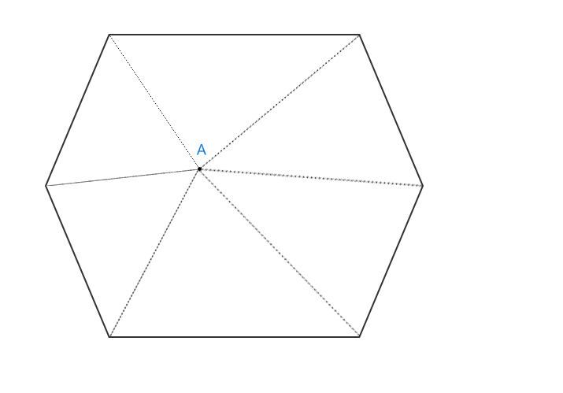
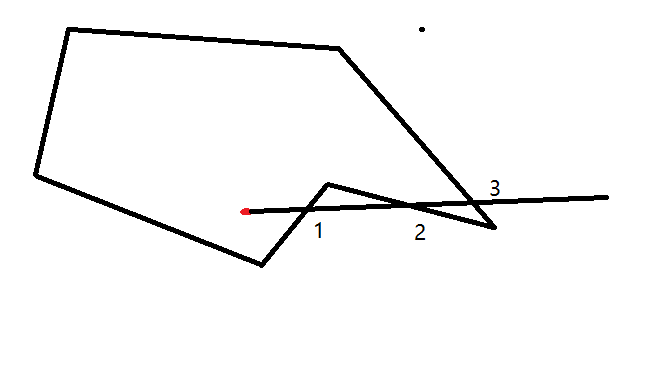

### canvas事件模拟

### 一.预览demo
1. demo 运行方式
* npm install
* npm run dev

2. demo 预览图片

### 前置

> 关于canvas事件模拟方式罗列

#### 1. isPointInPath + Path2D  API (存在极大的兼容性)
  * CanvasRenderingContext2D.isPointInPath()是 Canvas 2D API 用于判断在当前路径中是否包含检测点的方法。
  * 方法: CanvasRenderingContext2D.isPointInPath(x, y, fillRule, path)
  * 参数fillRule: 用来决定点在路径内还是在路径外的算法。 [nonzero: 非零环绕规则(默认), evenodd: 奇偶环绕规则]
  * path Path2D应用的路径
  * 返回值：一个Boolean值，当检测点包含在当前或指定的路径内，返回 true；否则返回 false。

#### 2. 角度法
  * 说明：如果一个点在多边形内部，则该点与多边形所有顶点两两构成的夹角，相加应该刚好等于360°。 
  * 局限性： 图形必须是凸多边形,其他类型的图形都不可以。

#### 3. 射线法
  * 说明：判断点与多边形一侧的交点个数为奇数，则点在多边形内部。
  * 该方法不局限于图形的类型，凸多边形，凹多边形，环形等都可以，边界条件处理方式预览具体情况具体分析
  * 难度：每个图形都需要有相应的函数判断射线边界
  * 

#### 4.像素法
  * 说明: canvas中的图形分别离屏绘制,通过判断事件的位置数据(getImageData()方法获取)，是否跟事件的唯一id一致来dispatch事件
  * 该项目使用的是像素法监听事件。

#### 5. ...其他

### 特别注明(API以及其他)

#### 1. OffscreenCanvas

* 构造函数OffscreenCanvas 创建一个新的OffscreenCanvas对象。 提供了一个可以脱离屏幕渲染的canvas对象。它在窗口环境和web worker环境均有效。
* 存在兼容性，并且该API之后可能废弃，未作兼容处理，兼容性处理方式可以是用一个隐藏的Canvas对象代替 new OffscreenCanvas()

#### 2. getImageData
* CanvasRenderingContext2D.getImageData(sx, sy, sw, sh) 返回一个ImageData对象，用来描述canvas区域隐含的像素数据，这个区域通过矩形表示，起始点为(sx, sy)、宽为sw、高为sh。
* 参数：sx, sy:将要被提取的图像数据矩形区域的左上角 x,y 坐标。 sw, sh:将要被提取的图像数据矩形区域的宽度, 高度
* 注意这里getImageData().data 的取值范围为(0,255)所以这里 按照0-> 0 , 1->255的范围

###  3.正多边形绘制方式
* 原理是中心点到所有角顶点的集合加起来为360度

#### 4.五角星绘制方式
* 可以理解成内部一个正五边形，外部一个正五边形，并且每个角度固定

#### 5.心绘制方式
* 公式: x = 16 * (sint)**3; y = 13cost - 5cons2t - 2cos3t - cos4t

